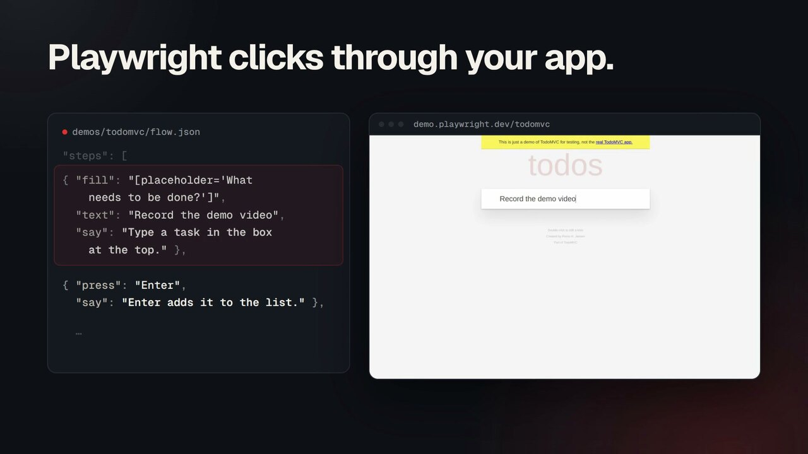

<h1 align="center">
  <picture>
    <source media="(prefers-reduced-motion: reduce) and (prefers-color-scheme: dark)" srcset="docs/assets/banner-static-dark.png" />
    <source media="(prefers-reduced-motion: reduce)" srcset="docs/assets/banner-static-light.png" />
    <source media="(prefers-color-scheme: dark)" srcset="docs/assets/banner-dark.apng" />
    
  </picture>
</h1>

<p align="center">
  <strong>Product demo videos from a script.</strong><br />
  Write the flow once. DemoForge drives your app, zooms on every click,<br />
  narrates it, and exports an MP4. When the UI changes, run it again.
</p>

<p align="center">
  <a href="https://github.com/DixitRam/Demo-Forge/actions/workflows/ci.yml"></a>
  <a href="LICENSE"></a>
  
  
  
</p>

<p align="center">
  <a href="#quick-start">Quick start</a> ·
  <a href="#how-it-works">How it works</a> ·
  <a href="#docs">Docs</a>
</p>

<p align="center">
  <picture>
    <source media="(prefers-reduced-motion: reduce)" srcset="docs/assets/hero-still.jpg" />
    <source type="image/avif" srcset="docs/assets/hero.avif" />
    
  </picture>
</p>

## Why DemoForge

Demo videos go out of date the moment the UI changes, and re-recording means
redoing the zooms and the voiceover by hand. In DemoForge a demo is a file, so
re-recording is one command.

- **Auto-zoom on every click.** Zooms come from the click log, not computer
  vision. The browser already knows where you clicked.
- **A smooth cursor.** Drawn by DemoForge with natural motion, since
  Playwright never moves a real one.
- **Narration that sets the pace.** Each step waits until its line has been
  said. Free local voice (espeak-ng), or Gemini, ElevenLabs or Mistral with a
  key.
- **A browser editor for the last 10%.** Drag zooms, cut, add captions, change
  the background, then export.
- **Built for agents.** Ask Claude Code to "record a demo of /login" and it
  writes the flow, records it and checks the frames. Projects are plain JSON.
- **Record by hand too.** A Chrome extension captures any tab into the same
  editor.

## Quick start

You need Node 20.19+, pnpm and ffmpeg. For a free local voice, install espeak-ng
(`dnf install espeak-ng` / `apt install espeak-ng`). No API key needed.

```sh
pnpm install
pnpm -C packages/core build
pnpm exec playwright-core install chromium

node scripts/demoforge.mjs record demos/todomvc/flow.json   # drive the app, record, write the script
node scripts/demoforge.mjs open   demos/todomvc             # open the take in the editor
```

In the editor, open **Script & voice** and press **Generate voiceover**, then
**Export**. You get an MP4 with the zooms, the cursor and the narration.

This records Playwright's public TodoMVC demo. To demo your own app, copy
`demos/todomvc/flow.json` and point `url` at it.

`node scripts/demoforge.mjs export demos/todomvc` renders the same MP4 from the
command line, for scripts and CI. It is silent unless the take folder already
holds a narration `.wav`.

## How it works

A demo is a `flow.json`: Playwright steps, each with an optional line of
narration.

```jsonc
{
  "url": "https://demo.playwright.dev",
  "start": "/todomvc/",
  "viewport": [1280, 800],
  "steps": [
    { "fill": "[placeholder='What needs to be done?']", "text": "Ship it",
      "say": "Type a task in the box at the top." },
    { "press": "Enter", "say": "Enter adds it to the list." },
    { "click": "role=link[name='Active']", "say": "Active shows only what's left to do." }
  ]
}
```

1. **Record.** DemoForge opens the app in Chromium, runs the steps and speaks
   each line. It saves the video, a log of every click, and a project file.
   Sign-in steps can run off camera, and `${SECRETS}` come from `.env`.
2. **Edit.** The editor plans a zoom for every click and draws the cursor. You
   fix what you want: zooms, cuts, captions, script, voice, background, aspect
   ratio.
3. **Export.** Native ffmpeg renders the MP4, with the voice mixed in and the
   page audio lowered under it.

The flow is the only file you commit. When the UI changes, run `record` again.

## Docs

| Guide | What's in it |
| --- | --- |
| [Recording demos](docs/recording.md) | Agent-recorded flows, the Claude Code skill, the Chrome extension |
| [The editor](docs/editor.md) | Panels, aiming zooms, captions, cutting, keyboard shortcuts |
| [Narration and voices](docs/narration.md) | AI-written scripts, voice providers and API keys, how the voiceover is mixed |
| [The project file](docs/project-format.md) | The `.dfp.json` format, for scripts and agents that edit projects |
| [Architecture](docs/architecture.md) | The design contract, how to verify it, known limits |
| [Design docs](docs/design/README.md) | The original product vision and the reasoning behind the architecture |

## Project layout

```
packages/core       @demoforge/core: types, zoom planner, cursor path, project format
apps/editor         Vite + React editor: player, timeline, compositor, export
apps/extension      Chrome extension for recording by hand
scripts/            demoforge.mjs: the record / open / export CLI
.claude/skills/     the demoforge skill for Claude Code
```

Run the tests with `pnpm -r test`.

## License

[MIT](LICENSE)
